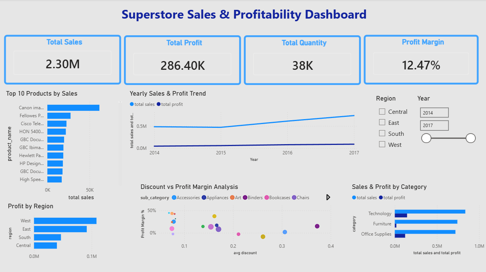

# Superstore Sales Analysis

## Dashboard Preview

## Project Overview

This project analyzes Superstore sales data to understand sales performance, profit trends, customer behavior, product performance, and regional performance.

The project was completed using Python, MySQL, and Power BI.

---

## Tools Used

* Python (Pandas, Matplotlib)
* MySQL
* Power BI
* Jupyter Notebook

---

## Data Cleaning

The dataset was cleaned using Pandas by:

* Checking missing values
* Checking duplicate records
* Converting date columns into the correct format
* Removing unnecessary columns
* Preparing the data for analysis

---

## Exploratory Data Analysis (Python)

The following analyses and visualizations were created:

* Yearly Profit Trend
* Yearly Sales and Profit Trend
* Monthly Sales and Profit Trend
* Sales and Profit by Category
* Sales and Profit by Region
* Top Products by Sales and Profit
* Regional Sales Distribution

---

## SQL Analysis

Business analysis was performed using MySQL.

The following areas were analyzed:

* Overall Sales, Profit, and Quantity
* Yearly Sales and Profit Performance
* Segment Analysis
* Regional Analysis
* Category and Sub-Category Analysis
* Product Performance Analysis
* Customer Analysis
* Shipping Mode Analysis
* Discount Impact Analysis

---

## Power BI Dashboard

An interactive dashboard was created using Power BI.

Dashboard features include:

* Total Sales
* Total Profit
* Total Quantity
* Profit Margin
* Sales and Profit Trends
* Category Analysis
* Regional Analysis
* Product Analysis
* Region Filter

---

## Key Findings

* Sales and profit increased over the years.
* Technology was one of the best-performing categories.
* Some regions generated higher profits than others.
* Some products had high sales but low profit margins.
* Higher discounts often reduced profitability.
* Repeat customers contributed significantly to sales.

---

## Recommendations

* Focus more on high-profit products.
* Review discount strategies for low-profit products.
* Improve performance in lower-performing regions.
* Encourage repeat purchases from existing customers.
* Promote products with strong profit margins.

---

## Conclusion

This project demonstrates an end-to-end data analysis process including data cleaning, data analysis, SQL querying, data visualization, and dashboard creation.

The insights can help businesses make better decisions to improve sales and profitability.
